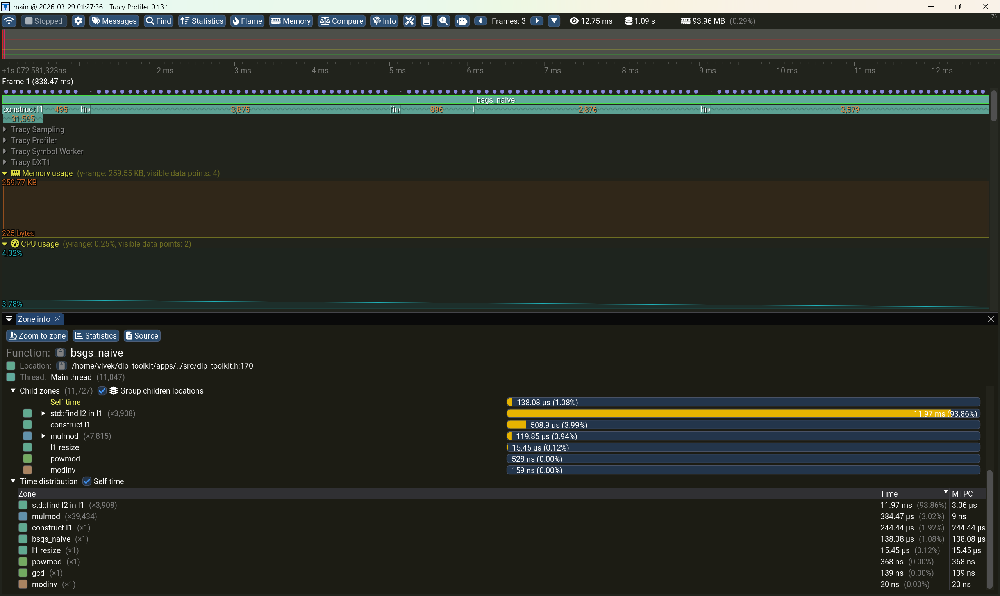
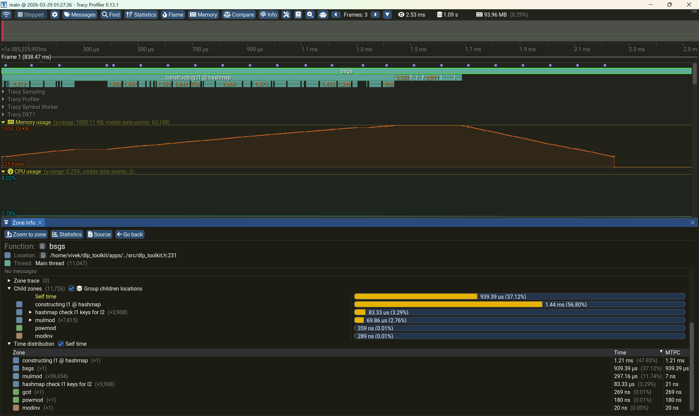
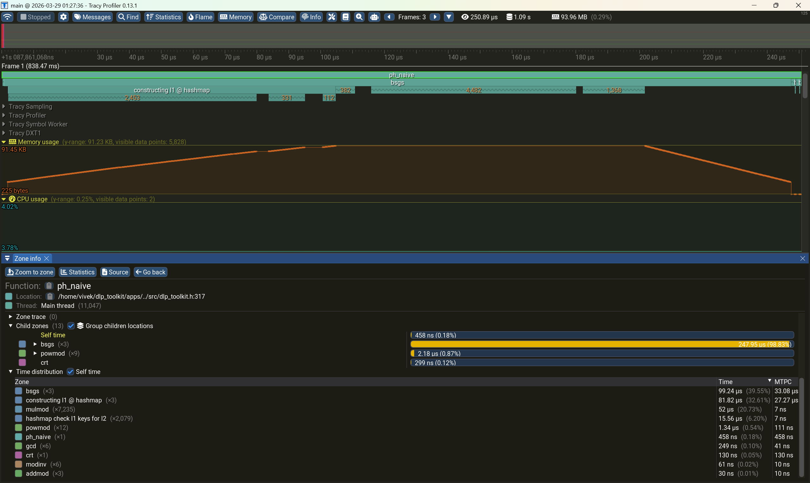
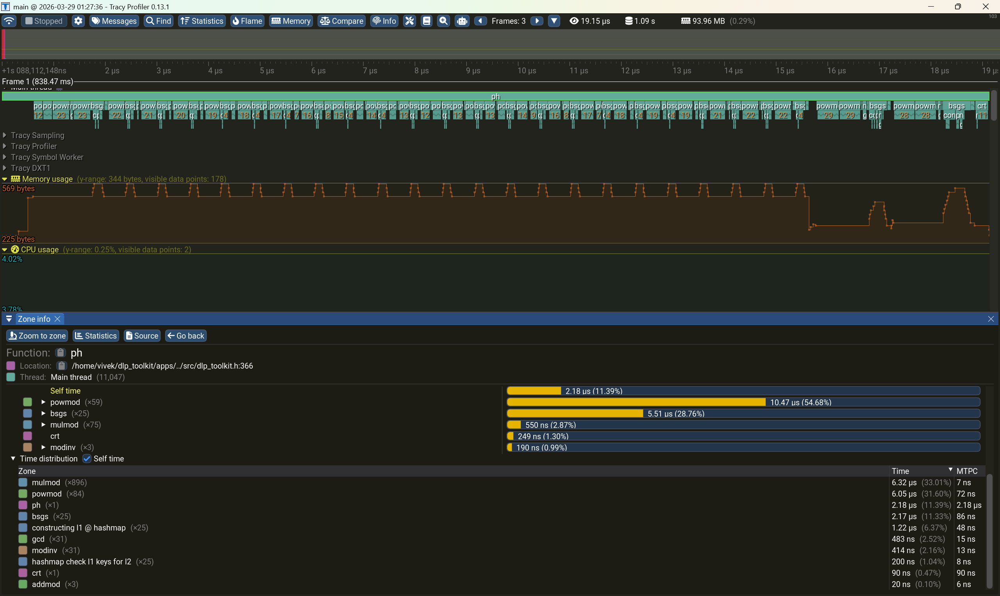

# dlp_toolkit

---

A C++ implementation of the Baby-steps Giant-steps algorithm and Pohlig-Hellman algorithm over finite fields. All core functions are profiled with Tracy. Inspired by taking an applied number theory course using Hoffstein-Pipher-Silverman.

Implements and benchmarks four algorithms of increasing sophistication. It starts with `bsgs_naive()` which constructs the list as a vector of unsigned 64-bit integers and does a linear search for each element of list 2. (Fun fact: The real BSGS algorithm doesn't even suggest this, doing a binary search for the collision instead. I just thought this would be an interesting comparison of different C++ containers.) I then implemented the more optimized version of `bsgs()` which swaps the `std::vector<u64>` for a `std::unordered_map<u64, u64>`. This makes searching for the collision value reduce to computing a hash function of a candidate value instead of linear search. Next, I implement the Pohlig-Hellman algorithm which leverages the factorization of p-1 for a finite field F_p, reducing the search space. The key here is that the naive Pohlig-Hellman (`ph_naive()`) reduces the search space to subgroups of prime-power order and the full Pohlig-Hellman (`ph()`) reduces prime-power order searches to just prime order searches. The result is **~666x speedup over `bsgs_naive()` on a 30-bit prime**.

---

## Functions

| Function     | Description                                                                                   |
| ------------ | --------------------------------------------------------------------------------------------- |
| `bsgs_naive` | Baby-step Giant-step with linear scan                                                         |
| `bsgs`       | Baby-step Giant-step with hashmap lookup                                                      |
| `ph_naive`   | Pohlig-Hellman: reduces DLP to subgroup DLPs, solves each with `bsgs`                         |
| `ph`         | Pohlig-Hellman: reduces prime-power order (`q^e`) subgroup DLPs to `e` prime order (`q`) DLPs |
| `powmod`     | Returns a^b mod m using the fast-powering algoirthm.                                          |
| `mulmod`     | Returns (a \* b) mod m. Promotes to u128 before multiplciation to prevent overflow.           |
| `addmod`     | Returns (a \+ b) mod m. Promotes to u128 before addition to prevent overflow.                 |
| `gcd`        | Extended Euclidean Algorithm, returning gcd and Bezout coefficients.                          |
| `modinv`     | Returns a^-1 mod m via the extended euclidean algorithm.                                      |

## Benchmark Results

Test case: `g = 3`, `p = 998244353`, `p-1 = 2^23 x 7 x 17`

All timings from Tracy instrumented builds compiled using the `make tracy` compilation option, described at the bottom of the page.

| Algorithm    | Time      | Peak Memory | Speedup vs `bsgs_naive` |
| ------------ | --------- | ----------- | ----------------------- |
| `bsgs_naive` | 12.75 ms  | 259.77 KB   | 1x                      |
| `bsgs`       | 2.53 ms   | 1000.33 KB  | ~5x                     |
| `ph_naive`   | 250.89 µs | 91.45 KB    | ~51x                    |
| `ph`         | 19.15 µs  | 569 Bytes   | ~666x                   |

### `bsgs_naive`



### `bsgs`



### `ph_naive`



### `ph`



## Project File Structure

---

```
dlp_toolkit/
├── apps/
│   ├── CMakeLists.txt
│   └── main.cpp
├── python/
│   ├── CMakeLists.txt
│   ├── bindings.cpp
│   ├── elliptic_curve_visualizer.py
│   └── tests.py
├── src/
│   ├── CMakeLists.txt
│   ├── dlp_toolkit.cpp
│   └── dlp_toolkit.h
├── CMakeLists.txt
├── Makefile
└── README.md
```

---

## Project Dependencies

- GCC 13+
- CMake >= 3.20
- Git
- Tracy v0.13.1
- pybind11 v2.11.1
- python3-dev ( for python bindings )

Tracy and pybind11 are fetched and installed using CMake's FetchContent_Declare() function. Thus, they are only installed when needed or specified by compile options. To actually observe and interact with the Tracy profiled code, you do need to install the tracy-profiler executable separately. Tracy is very particular about versioning. The executable version MUST MATCH THE EXACT sourcec dependcy version. This project compiles with Tracy v0.13.1 .

## Quick-Setup

Here is the quickest way to setup, test, and run the code in this project. I assume the base machine is a fresh Ubuntu 24.04 install.

```
apt-get update
apt-get install -y build-essential cmake git
git clone https://github.com/vivek-ramadhar/dlp_toolkit.git
cd dlp_toolkit
make
./build/apps/main
```

This compiles and runs the test contained inside `apps/main.cpp`. The Makefile provides a simpler interface to the various CMake project targets and different compilation options.

Here are the most common/important compilation options:

`make debug`
This sets the CMAKE_BUILD_TYPE to Debug, which in turn defines the macro `DEBUG` to enable certain sections of source guarded by `#ifdef DEBUG`. Additionally, it enables the TRACY compilation options which defines the `TRACY_ENABLE` macro, and builds the Tracy target.

`make release`
This sets the CMAKE_BUILD_TYPE to Release and enables the NATIVE compilation options (just `-O3 -march=native`)

`make tracy`
This sets the CMAKE_BUILD_TYPE to Release, enables the NATIVE compilation options, and enables the TRACY compilation option.

`make bindings`
This just enables the BINDINGS compilation option, which compiles the `python/bindings.cpp` file into a python library (PY_MODULE.so) which is then installed and copied to project root so it can be easily imported in python scripts.

`make clean`
This deletes all content of the build/ folder and and finds the python .so file and deletes that too.

---
